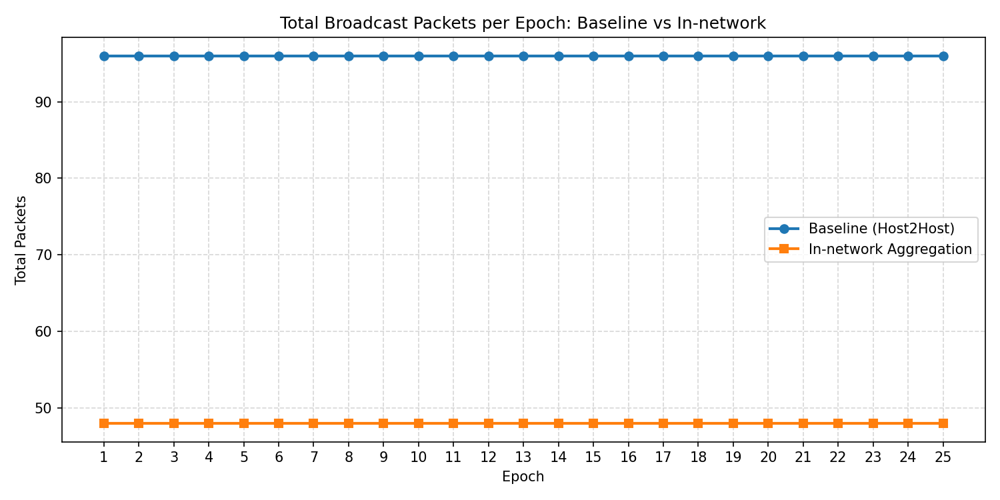

# Federated Learning over P4: Baseline vs In-Network Aggregation

## Overview
This repository implements a distributed/federated learning experiment on a P4-programmable data plane with two methods:

1. `Baseline (Host-to-Host)`
2. `In-network Aggregation (Switch-assisted)`

Network topology is fixed to `h1`, `h2`, `h3` connected to a single switch `s1`.

Core requirement implemented in both methods:
- model updates are sent in **chunks** (not one large packet)
- communication uses a custom EtherType: `0x1234`

## What Is Implemented

### Baseline path
- Worker: `src/worker/worker.py`
- Protocol layer: `src/protocol/layers.py`
- P4 program: `p4/federated_learning.p4`
- Switch rules: `p4/switch-commands.txt`
- Topology config: `p4app.json`

Behavior:
- each host trains locally
- each host sends chunked weights directly to peer hosts
- each host receives peer models and computes local FedAvg

### In-network path
- Worker: `src/worker/worker_in_network.py`
- Protocol layer: `src/protocol/layers_in_network.py`
- P4 program: `p4/federated_learning_in_network.p4`
- Switch rules: `p4/switch-commands-in-network.txt`
- Topology config: `p4app_in_network.json`

Behavior:
- hosts send chunked vectors to `s1`
- switch aggregates each chunk in registers
- switch multicasts aggregated chunk to all hosts
- hosts reconstruct full aggregated model from chunks

## Packet Design

### Baseline aggregation packet
Fields:
- `round_id`
- `worker_id`
- `chunk_id`
- `total_chunks`
- `chunk_len`
- payload: scaled `int32` chunk values

### In-network aggregation packet
Fields:
- `round_id`
- `worker_id` (`0` means switch-generated aggregated result)
- `chunk_id`
- `total_chunks`
- `chunk_len`
- `value0..value9` (10 encoded values in header)

Encoding (in-network):
- sender: `encoded = round(weight * WEIGHT_SCALE) + WEIGHT_OFFSET`
- switch: sums encoded values across workers
- receiver: `avg = (sum_encoded - N * WEIGHT_OFFSET) / (WEIGHT_SCALE * N)`

## Key Configuration

Current constants in code:
- `CHUNK_SIZE = 10` for both methods
- baseline `REDUNDANCY_FACTOR = 2` (reliability workaround)
- synchronization barrier `PRE_SEND_BARRIER_SEC = 5`

Note on fairness:
- for strict traffic-fair baseline comparison, set `REDUNDANCY_FACTOR = 1`

## Topology and Addressing

Hosts:
- `h1`: `10.0.1.1/24`, `00:00:00:00:01:01`
- `h2`: `10.0.1.2/24`, `00:00:00:00:01:02`
- `h3`: `10.0.1.3/24`, `00:00:00:00:01:03`

Switch-facing MACs:
- port 1: `00:00:00:00:00:01`
- port 2: `00:00:00:00:00:02`
- port 3: `00:00:00:00:00:03`

## Prerequisites
- Linux VM with P4 toolchain and Mininet (e.g., p4-utils VM)
- `p4run` available
- Python 3.10+
- Python packages from `requirements.txt`

Install Python dependencies:

```bash
pip3 install -r requirements.txt
```

## Getting Started

Clone and enter project:

```bash
git clone https://github.com/ashkntarivrdi/Federated-Learning-P4.git
cd Federated-Learning-P4
```

## Running Experiments

### Run baseline

Terminal 1:

```bash
sudo p4run --config p4app.json
```

Terminal 2:

```bash
nohup python3 src/worker/worker.py 1 > /tmp/worker1.log 2>&1 &
nohup python3 src/worker/worker.py 2 > /tmp/worker2.log 2>&1 &
nohup python3 src/worker/worker.py 3 > /tmp/worker3.log 2>&1 &
```

### Run in-network aggregation

Terminal 1:

```bash
sudo p4run --config p4app_in_network.json
```

Terminal 2:

```bash
nohup python3 src/worker/worker_in_network.py 1 > /tmp/worker1_innet.log 2>&1 &
nohup python3 src/worker/worker_in_network.py 2 > /tmp/worker2_innet.log 2>&1 &
nohup python3 src/worker/worker_in_network.py 3 > /tmp/worker3_innet.log 2>&1 &
```

## PCAP Analysis Scripts

### Packets per epoch for one run

```bash
python3 scripts/plot_packets_per_epoch.py
```

### Baseline vs in-network comparison

```bash
python3 scripts/plot_baseline_vs_innet_packets.py
```

Hardcoded input directories in comparison script:
- `./pcap_baseline`
- `./pcap_innet`

Output figure:
- `results/baseline_vs_innet_packets_per_epoch.png`

## Final Results (Measured)

Data source:
- `pcap_baseline/*.pcap`
- `pcap_innet/*.pcap`
- 25 training epochs

Measured packet counts:
- Baseline: `96` packets per epoch
- In-network: `48` packets per epoch
- Baseline total (25 epochs): `2400`
- In-network total (25 epochs): `1200`

Reduction:
- In-network uses `50%` fewer packets than baseline in this setup
- Equivalent improvement factor: baseline traffic is `2x` in-network

### Comparison Table

| Metric | Baseline | In-network |
|---|---:|---:|
| Packets per epoch | 192 | 96 |
| Total packets (25 epochs) | 4800 | 2400 |
| Relative to baseline | 100% | 50% |

## Result Figures

Baseline-only packet plot:


In-network-only packet plot:


Direct comparison:



## Analysis

Main observations:
- Packet count is constant across epochs for both methods. This is expected because model size, chunk size, and worker count are fixed.
- In-network aggregation significantly reduces communication volume by moving aggregation to switch data plane and avoiding host-to-host all-to-all exchange overhead.
- The vector chunk format (`value0..value9`) is critical. A per-element packet format causes packet explosion and worse performance.


Practical takeaway:
- For this project setup and measured traces, in-network aggregation is the better communication design in terms of packet overhead.

## Known Engineering Notes
- BMv2/v1model limitations required careful P4 coding (no unsupported control constructs in deparser/checksum pipeline).
- Runtime reliability issues in host-side packet handling were mitigated using synchronization barrier and conservative send pacing.
- Integer encoding/decoding was used because P4 data plane does not support floating-point arithmetic.

## Repository Structure

```text
p4/
  federated_learning.p4
  federated_learning_in_network.p4
  switch-commands.txt
  switch-commands-in-network.txt
src/
  worker/
    worker.py
    worker_in_network.py
  protocol/
    layers.py
    layers_in_network.py
  ml/
    model.py
    data_loader.py
scripts/
  plot_packets_per_epoch.py
  plot_baseline_vs_innet_packets.py
p4app.json
p4app_in_network.json
results/
  packets_per_epoch.png
  packets_per_epoch_innet.png
  baseline_vs_innet_packets_per_epoch.png
```

## License
Educational use for Advanced Computer Networks coursework.
